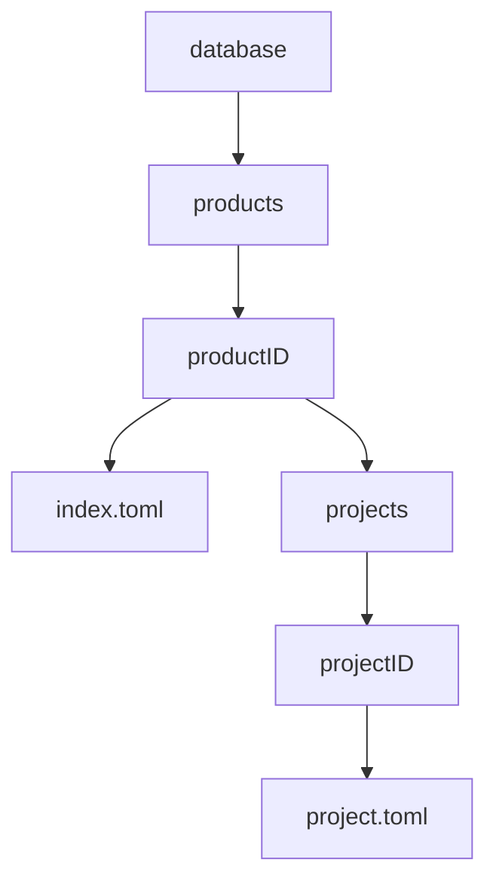
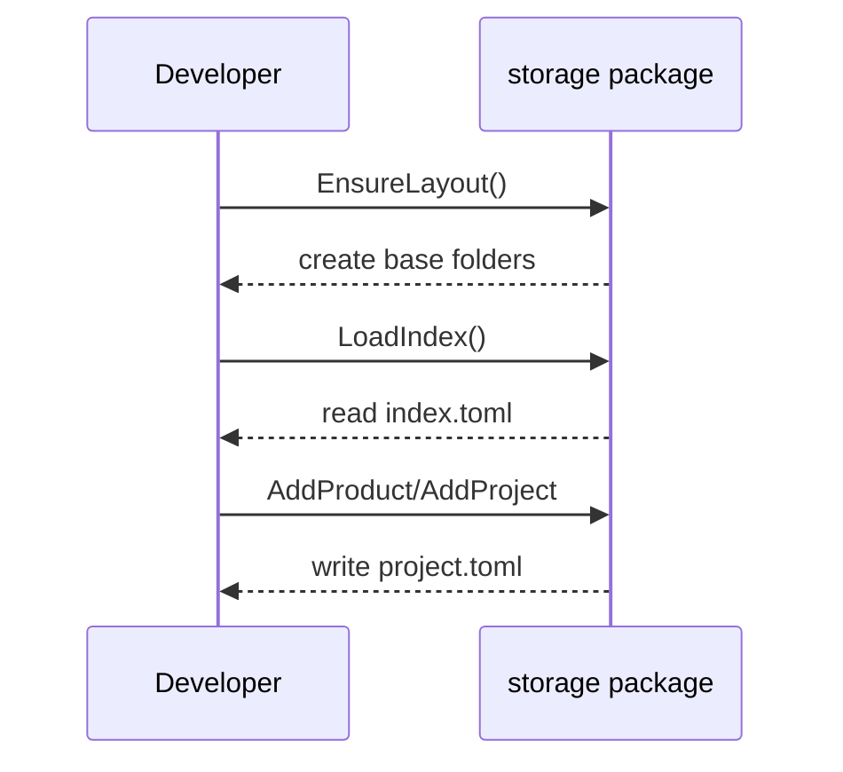

# PMFS

PMFS (Product Manager File System) is a lightweight backend for storing and organizing product and project data using simple TOML files on disk. It helps create the directory layout and offers helpers to read and write product and project metadata.

## Dependencies

- [Go](https://go.dev/) 1.23 or newer
- Git
- External Go packages:
  - `github.com/pelletier/go-toml/v2`

## Configuration

1. **Install Go** and ensure `go` is available in your `PATH`.
2. **Clone the repository**:
   ```bash
   git clone https://github.com/rjboer/PMFS.git
   cd PMFS
   ```
3. **Download modules**:
   ```bash
   go mod download
   ```

## Directory Structure

The backend stores its data in a folder called `database`. Inside it, each product gets its own subdirectory and keeps an `index.toml` of projects.



## Quick Start

```bash
# Ensure the directory layout exists
mkdir -p database

# Run tests
go test ./...

# Build the module
go build ./...
```

## Basic Actions



## Example Usage

```go
package main

import (
    "fmt"

    "github.com/rjboer/PMFS/storage"
)

func main() {
    if err := storage.EnsureLayout(); err != nil {
        panic(err)
    }
    idx, _ := storage.LoadIndex()
    fmt.Println(idx.Products)
}
```
