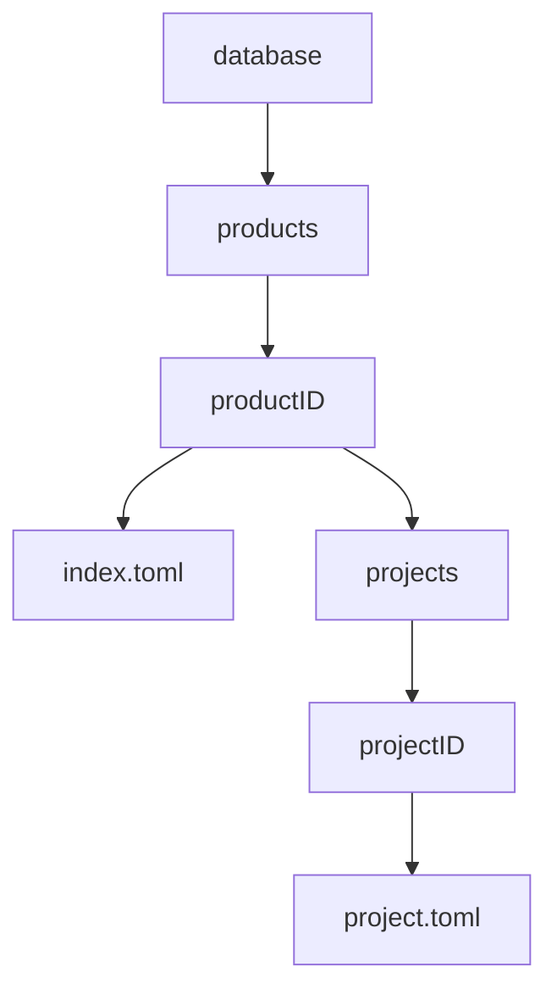
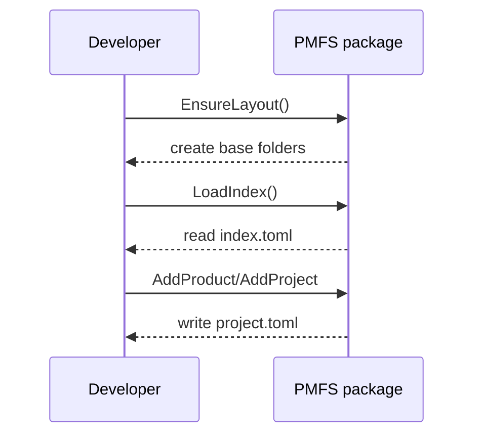

# PMFS

PMFS (Product Manager File System) is a lightweight backend for storing and organizing product and project data using simple TOML files on disk. It helps create the directory layout and offers helpers to read and write product and project metadata.

## Dependencies

- [Go](https://go.dev/) 1.23 or newer
- Git
- External Go packages:
  - `github.com/pelletier/go-toml/v2`

## Configuration

1. **Install Go** and ensure `go` is available in your `PATH`.
2. **Clone the repository**:
   ```bash
   git clone https://github.com/rjboer/PMFS.git
   cd PMFS
   ```
3. **Download modules**:
    ```bash
    go mod download
    ```

### Environment Variables

The library reads configuration from environment variables. You can place them
in a local `.env` file which is loaded automatically.

Required variables:

- `PMFS_BASEDIR` – base directory used to store PMFS data.
- `GEMINI_API_KEY` – API key for Gemini integrations.

## Directory Structure

The backend stores its data in a folder called `database`. Inside it, each product gets its own subdirectory and keeps an `index.toml` of projects.
The index contains only lightweight metadata (project IDs and names); each project's detailed data lives in its own `project.toml` file.



## Quick Start

```bash
# Ensure the directory layout exists
mkdir -p database

# Run tests
go test ./...

# Build the module
go build ./...
```

## Basic Actions



## Example Usage

```go
package main

import (
    "fmt"

    PMFS "github.com/rjboer/PMFS"
)

func main() {
    if err := PMFS.EnsureLayout(); err != nil {
        panic(err)
    }
    idx, _ := PMFS.LoadIndex()
    fmt.Println(idx.Products)
}
```

A runnable sample program lives in `examples/basic` and can be run with:

```bash
 go run ./examples/basic
```

An example demonstrating the Gemini client lives in `examples/gemini` and can be run with:

```bash
go run ./examples/gemini
```

## Available Functions

- `EnsureLayout()`
- `LoadIndex()`
- `(*Index) AddProduct(name string) error`
- `(*Index) SaveIndex() error`
- `(*ProductType) AddProject(idx *Index, projectName string) error`
- `(*ProjectType) SaveProject() error`
- `(*ProjectType) LoadProject() error`
- `(*ProductType) LoadProjects() error`
- `(*Index) LoadAllProjects() error`
- `(*ProjectType) IngestInputDir(inputDir string) ([]Attachment, error)`
- `(*ProjectType) AddAttachmentFromInput(inputDir, filename string) (Attachment, error)`

See [FUNCTIONS.md](FUNCTIONS.md) for detailed descriptions.

