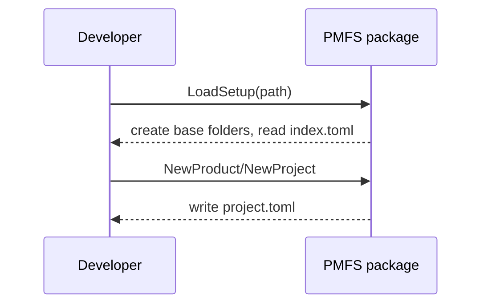

# PMFS

PMFS (Product Manager File System) is a lightweight backend for storing and organizing product and project data using simple TOML files on disk. It helps create the directory layout and offers helpers to read and write product and project metadata.

## Dependencies

- [Go](https://go.dev/) 1.23 or newer
- Git
- External Go packages:
  - `github.com/pelletier/go-toml/v2`

## Configuration

1. **Install Go** and ensure `go` is available in your `PATH`.
2. **Clone the repository**:
   ```bash
   git clone https://github.com/rjboer/PMFS.git
   cd PMFS
   ```
3. **Download modules**:
    ```bash
    go mod download
    ```

### Environment Variables

The library reads configuration from environment variables. You can place them
in a local `.env` file which is loaded automatically.

Required variables:

- `PMFS_BASEDIR` – base directory used to store PMFS data.
- `GEMINI_API_KEY` – API key for Gemini integrations.

The default Gemini client reads `GEMINI_API_KEY` automatically. When this
variable is set, package functions will use the live API without any
`SetClient` call.

### Start a Project in One Call

With the environment prepared you can spin up a project in a single step. Set
`PMFS_BASEDIR` (and `GEMINI_API_KEY` for live LLM features) and call
`pmfs.NewProject`:

```bash
export PMFS_BASEDIR=/tmp/pmfs
export GEMINI_API_KEY=your-key   # required for LLM features
```

```go
package main

import (
    "log"

    "github.com/rjboer/PMFS/pmfs"
)

func main() {
    prj, err := pmfs.NewProject("Demo Project")
    if err != nil {
        log.Fatal(err)
    }
    _ = prj // project is ready to use
}
```

## Directory Structure

The backend stores its data in a folder called `database`. Inside it, each product gets its own subdirectory and keeps an `index.toml` of projects.
The index contains only lightweight metadata (project IDs and names); each project's detailed data lives in its own `project.toml` file.


## Quick Start

```bash
# Ensure the directory layout exists
mkdir -p database

# Run tests
go test ./...

# Build the module
go build ./...
```

## Basic Actions



## Example Usage

```go
package main

import (
    "fmt"

    PMFS "github.com/rjboer/PMFS"
)

func main() {
    db, err := PMFS.LoadSetup("database")
    if err != nil {
        panic(err)
    }
    fmt.Println(db.Products)
}
```

A runnable sample program lives in `examples/basic` and can be run with:

```bash
 go run ./examples/basic
```

An example demonstrating the Gemini client lives in `examples/gemini`
(requires `GEMINI_API_KEY`) and can be run with:

```bash
go run ./examples/gemini
```

Gemini-related examples require a valid `GEMINI_API_KEY`. For a stubbed version
that runs offline, see `examples/mock`:

```bash
go run ./examples/mock
```

An example combining Gemini analysis, interactive questions, and gate evaluation lives in `examples/integration` (requires `GEMINI_API_KEY`) and can be run with:

```bash
go run ./examples/integration
```

An extended example that analyzes attachments, asks multiple roles, and evaluates gates lives in `examples/full` (requires `GEMINI_API_KEY`) and can be run with:

```bash
go run ./examples/full
```

## Available Functions

- `LoadSetup(path string) (*Database, error)`
- `(*Database) NewProduct(data ProductData) (int, error)`
- `(*Database) ModifyProduct(data ProductData) (int, error)`
- `(*Database) Save() error`
- `(*ProductType) NewProject(name string) (*ProjectType, error)`
- `(*ProjectType) Save() error`
- `(*ProjectType) Load() error`
- `(*ProductType) LoadProjects() error`
- `(*Database) LoadAllProjects() error`
- `(*ProjectType) IngestInputDir(inputDir string) ([]Attachment, error)`
- `(*ProjectType) AddAttachmentFromInput(inputDir, filename string) (Attachment, error)`
- `FromGemini(req gemini.Requirement) Requirement`

See [FUNCTIONS.md](FUNCTIONS.md) for detailed descriptions.

