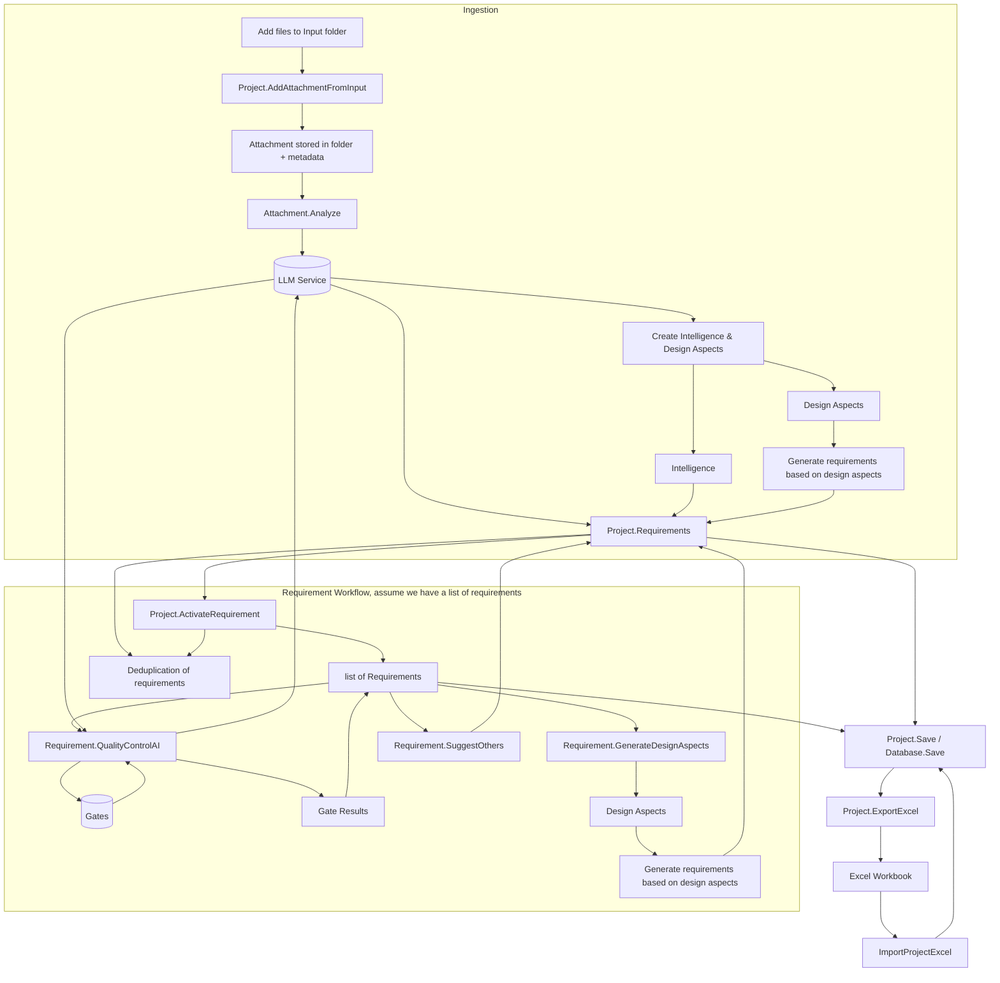

# PMFS Architecture Overview

```mermaid

flowchart TD

  LLM[(LLM Service)]
  GATE[(Gates)]

  %% --- Attachment ingestion ---
  subgraph Ingestion


    A[Add files to Input folder]
    A --> C[Project.AddAttachmentFromInput]
    C --> D[Attachment stored in folder + metadata]
    D --> E[Attachment.Analyze]
    E --> LLM
    LLM --> X1[Create Intelligence & Design Aspects]
    X1 --> X2[Intelligence]
    X1 --> X3[Design Aspects]
    LLM --> G[Project.Requirements]
    X2 --> G
    X3 --> X4[Generate requirements based on design aspects]
    X4 --> G
  end

  %% --- Requirement lifecycle ---
  subgraph "Requirement Workflow, assume we have a list of requirements"
    G --> H[Project.ActivateRequirement]
    H --> I[list of Requirements]
    I --> J[Requirement.QualityControlAI]
    J --> LLM
    J --> GATE
    LLM --> J
    GATE --> J
    J --> K[Gate Results]
    K --> I
    I --> L[Requirement.GenerateDesignAspects]
    L --> N[Design Aspects]
    N --> O[Generate requirements based on design aspects]
    O --> G
    I --> M[Requirement.SuggestOthers]
    M --> G
    G --> P[Deduplication of requirements]
    H --> P

  end

  %% --- Persistence ---
  G --> Q[Project.Save / Database.Save]
  I --> Q

  %% --- Excel Import/Export ---
  Q --> R[Project.ExportExcel]
  R --> S[Excel Workbook]
  S --> T[ImportProjectExcel]
  T --> Q

```

