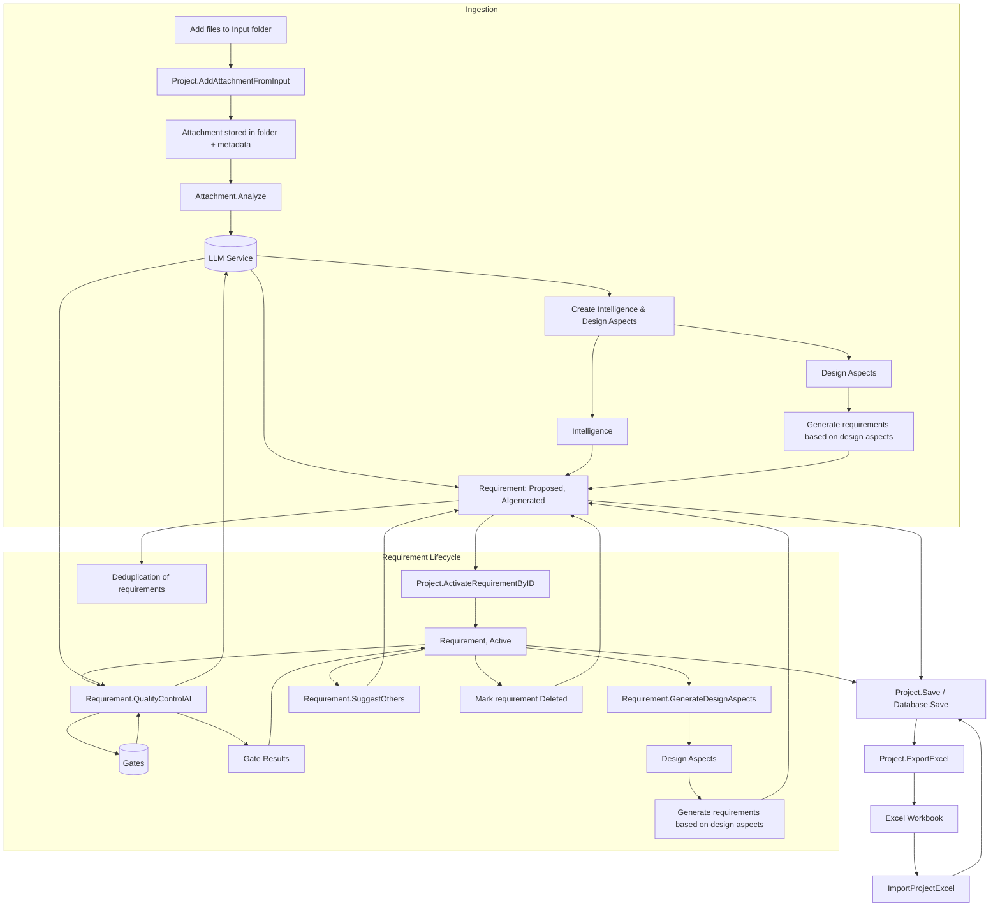

# PMFS Architecture Overview

PMFS maintains a single collection of requirements. Each requirement carries
condition flags that describe its lifecycle state. The diagram below illustrates
how artifacts are ingested and how requirements move through this lifecycle
using these flags.

## Requirement Condition Flags

- **Proposed** – candidate requirement awaiting activation. Proposed
  requirements are skipped by analysis and gating.
- **AIgenerated** – indicates the requirement originated from the LLM. User-created
  requirements leave this false.
- **AIanalyzed** – requirement has already been processed by the LLM and is
  skipped during subsequent analyses.
- **Active** – requirement is approved and participates in analysis, gating, and
  export.
- **Deleted** – requirement has been removed from active consideration but is
  retained for history and ignored by processing.

### Typical transitions

1. `Proposed` (often `AIgenerated`) → `Active` via activation.
2. `Proposed` → `Deleted` when a candidate is discarded.
3. `Active` → `Deleted` if an accepted requirement is later removed.

