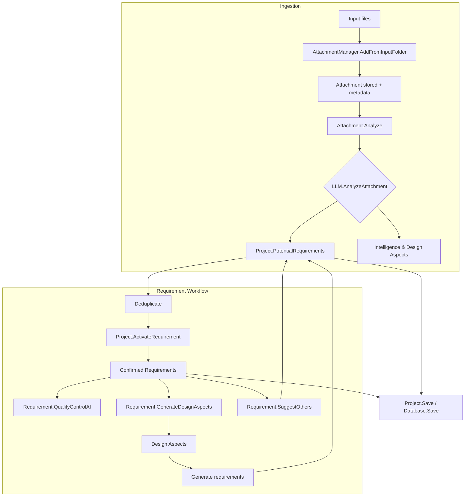

# PMFS Architecture Overview

```mermaid
flowchart TD
    %% --- Attachment ingestion ---
    subgraph Ingestion
        A[Input files] --> B[AttachmentManager.AddFromInputFolder]
        B --> C[Attachment stored + metadata]
        C --> D[Attachment.Analyze]
        D --> E{LLM.AnalyzeAttachment}
        E --> F[Project.PotentialRequirements]
        E --> G[Intelligence & Design Aspects]
    end

    %% --- Requirement lifecycle ---
    subgraph "Requirement Workflow"
        F --> H[Deduplicate]
        H --> I[Project.ActivateRequirement]
        I --> J[Confirmed Requirements]
        J --> K[Requirement.QualityControlAI]
        J --> L[Requirement.GenerateDesignAspects]
        L --> M[Design Aspects]
        M --> N[Generate requirements]
        N --> F
        J --> O[Requirement.SuggestOthers]
        O --> F
    end

    %% --- Persistence ---
    F & J --> P[Project.Save / Database.Save]
```

