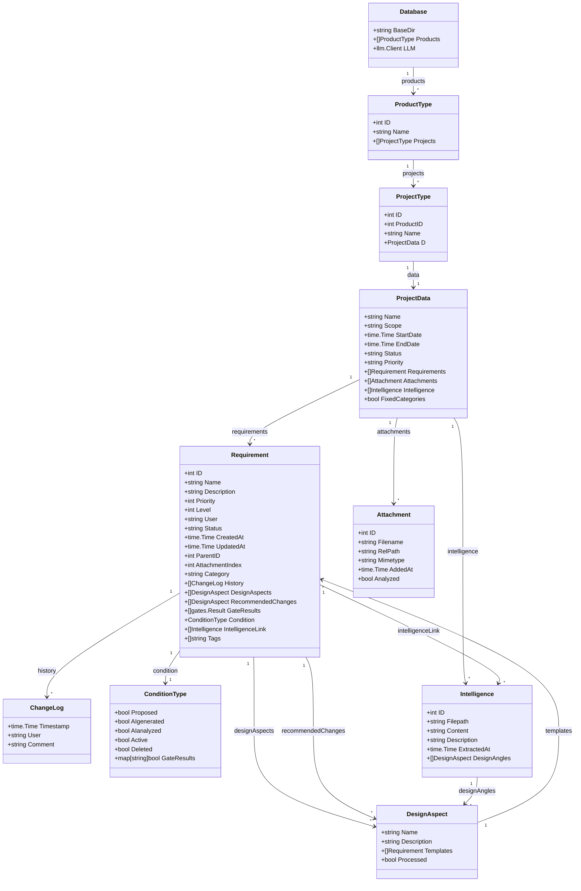

# PMFS Data Model

This diagram outlines the core structs in PMFS and how they relate to each other.

```mermaid
classDiagram
    class Database {
        +string BaseDir
        +[]ProductType Products
        +llm.Client LLM
    }

    class ProductType {
        +int ID
        +string Name
        +[]ProjectType Projects
    }

    class ProjectType {
        +int ID
        +int ProductID
        +string Name
        +ProjectData D
    }

    class ProjectData {
        +string Name
        +string Scope
        +time.Time StartDate
        +time.Time EndDate
        +string Status
        +string Priority
        +[]Requirement Requirements
        +[]Attachment Attachments
        +[]Intelligence Intelligence
        +bool FixedCategories
    }

    class Requirement {
        +int ID
        +string Name
        +string Description
        +int Priority
        +int Level
        +string User
        +string Status
        +time.Time CreatedAt
        +time.Time UpdatedAt
        +int ParentID
        +int AttachmentIndex
        +string Category
        +[]ChangeLog History
        +[]DesignAspect DesignAspects
        +[]DesignAspect RecommendedChanges
        +[]gates.Result GateResults
        +ConditionType Condition
        +[]Intelligence IntelligenceLink
        +[]string Tags
    }

    class DesignAspect {
        +string Name
        +string Description
        +[]Requirement Templates
        +bool Processed
    }

    class Attachment {
        +int ID
        +string Filename
        +string RelPath
        +string Mimetype
        +time.Time AddedAt
        +bool Analyzed
    }

    class ChangeLog {
        +time.Time Timestamp
        +string User
        +string Comment
    }

    class ConditionType {
        +bool Proposed
        +bool AIgenerated
        +bool AIanalyzed
        +bool Active
        +bool Deleted
        +map[string]bool GateResults
    }

    class Intelligence {
        +int ID
        +string Filepath
        +string Content
        +string Description
        +time.Time ExtractedAt
        +[]DesignAspect DesignAngles
    }

    Database "1" --> "*" ProductType : products
    ProductType "1" --> "*" ProjectType : projects
    ProjectType "1" --> "1" ProjectData : data
    ProjectData "1" --> "*" Requirement : requirements
    ProjectData "1" --> "*" Attachment : attachments
    ProjectData "1" --> "*" Intelligence : intelligence
    Requirement "1" --> "*" ChangeLog : history
    Requirement "1" --> "*" DesignAspect : designAspects
    Requirement "1" --> "*" DesignAspect : recommendedChanges
    Requirement "1" --> "*" Intelligence : intelligenceLink
    Requirement "1" --> "1" ConditionType : condition
    DesignAspect "1" --> "*" Requirement : templates
    Intelligence "1" --> "*" DesignAspect : designAngles
```
