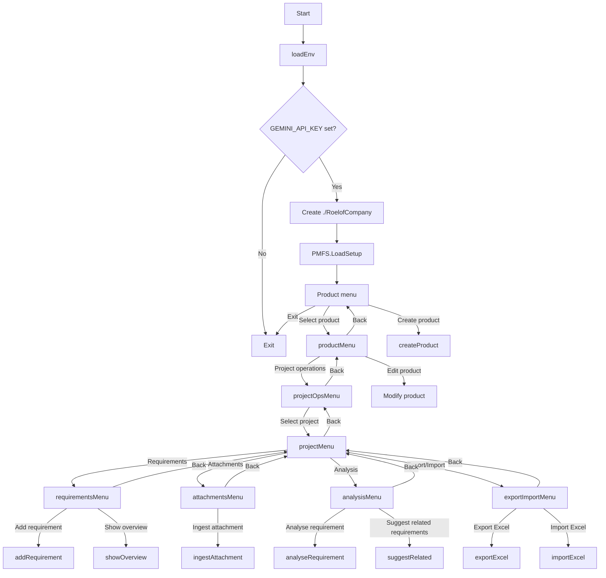

# Program Architecture

```mermaid
flowchart TD
    A[Start] --> B[loadEnv]
    B --> C{GEMINI_API_KEY set?}
    C -- No --> Z[Exit]
    C -- Yes --> D[Create ./RoelofCompany]
    D --> E[PMFS.LoadSetup]
    E --> F[Product menu]
    F -->|Select product| G[productMenu]
    F -->|Create product| H[createProduct]
    F -->|Exit| Z
    G -->|Project operations| I[projectOpsMenu]
    G -->|Edit product| J[Modify product]
    G -->|Back| F
    I -->|Select project| K[projectMenu]
    I -->|Back| G
    K -->|Requirements| L[requirementsMenu]
    K -->|Attachments| M[attachmentsMenu]
    K -->|Analysis| N[analysisMenu]
    K -->|Export/Import| O[exportImportMenu]
    K -->|Back| I
    L -->|Add requirement| L1[addRequirement]
    L -->|Show overview| L2[showOverview]
    L -->|Back| K
    M -->|Ingest attachment| M1[ingestAttachment]
    M -->|Back| K
    N -->|Analyse requirement| N1[analyseRequirement]
    N -->|Suggest related requirements| N2[suggestRelated]
    N -->|Back| K
    O -->|Export Excel| O1[exportExcel]
    O -->|Import Excel| O2[importExcel]
    O -->|Back| K
```

This diagram outlines the main control flow of the interactive example program.
