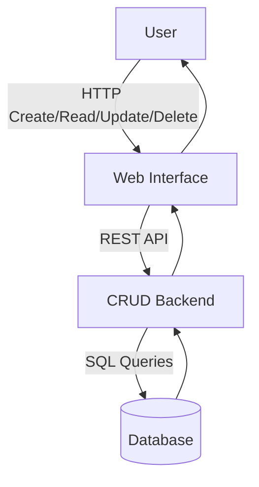

# Web Interface CRUD Architecture

```mermaid
flowchart TD
    User[User] -->|HTTP Create/Read/Update/Delete| WebUI[Web Interface]
    WebUI -->|REST API| Backend[CRUD Backend]
    Backend -->|SQL Queries| DB[(Database)]
    DB --> Backend --> WebUI --> User
```

This diagram illustrates how a user interacts with a web interface that communicates with a backend service to perform CRUD operations on a database.
