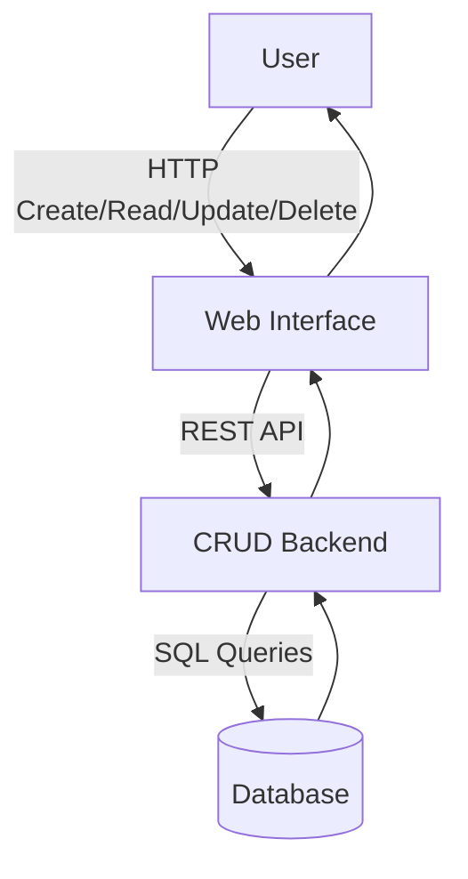

# Web Interface CRUD Architecture

This diagram illustrates how a user interacts with a web interface that communicates with a backend service to perform CRUD operations on a database.

## Interface to Function Mapping

```mermaid
flowchart LR
    %% Interface layer with endpoints
    subgraph Interface
        PPOST["POST /products"]
        PGET["GET /products/:id"]
        PGETALL["GET /products"]
        PPUT["PUT /products/:id"]
        PDEL["DELETE /products/:id"]

        PRPOST["POST /products/:pid/projects"]
        PRGET["GET /products/:pid/projects/:id"]
        PRGETALL["GET /products/:pid/projects"]
        PRPUT["PUT /products/:pid/projects/:id"]
        PRDEL["DELETE /products/:pid/projects/:id"]

        RPOST["POST /projects/:prid/requirements"]
        RGET["GET /projects/:prid/requirements/:id"]
        RGETALL["GET /projects/:prid/requirements"]
        RPUT["PUT /projects/:prid/requirements/:id"]
        RDEL["DELETE /projects/:prid/requirements/:id"]

        APOST["POST /requirements/:rid/attachments"]
        AGET["GET /requirements/:rid/attachments/:aid"]
        ADEL["DELETE /requirements/:rid/attachments/:aid"]

        ANPOST["POST /requirements/:rid/analyze"]
        SGGET["GET /requirements/:rid/suggestions"]

        EXGET["GET /projects/:prid/export/excel"]
        EXSTR["GET /projects/:prid/export/struct"]
        PRSTRUCT["GET /projects/:prid/struct{?depth,status,page}"]
        IMPOST["POST /projects/:prid/import/excel"]
    end

    %% Backend function layer
    subgraph Functions
        CreateProduct["CreateProduct(data)"]
        GetProduct["GetProduct(id)"]
        GetProducts["GetProducts()"]
        UpdateProduct["UpdateProduct(id, data)"]
        DeleteProduct["DeleteProduct(id)"]

        CreateProject["CreateProject(pid, data)"]
        GetProject["GetProject(pid, id)"]
        GetProjects["GetProjects(pid)"]
        UpdateProject["UpdateProject(pid, id, data)"]
        DeleteProject["DeleteProject(pid, id)"]

        CreateRequirement["CreateRequirement(prid, data)"]
        GetRequirement["GetRequirement(prid, id)"]
        GetRequirements["GetRequirements(prid)"]
        UpdateRequirement["UpdateRequirement(prid, id, data)"]
        DeleteRequirement["DeleteRequirement(prid, id)"]

        AddAttachment["AddAttachment(rid, data)"]
        GetAttachment["GetAttachment(rid, aid)"]
        DeleteAttachment["DeleteAttachment(rid, aid)"]

        AnalyzeReq["AnalyzeRequirement(rid)"]
        SuggestRelated["SuggestRelatedRequirements(rid)"]

        ExportExcel["ExportProjectExcel(prid)"]
        ExportStruct["ExportProjectStruct(prid)"]
        GetStruct["GetProjectStruct(prid, depth?, status?, page?)"]
        ImportExcel["ImportProjectExcel(prid, file)"]
    end

    %% Mappings between interface endpoints and backend functions
    PPOST --> CreateProduct
    PGET --> GetProduct
    PGETALL --> GetProducts
    PPUT --> UpdateProduct
    PDEL --> DeleteProduct

    PRPOST --> CreateProject
    PRGET --> GetProject
    PRGETALL --> GetProjects
    PRPUT --> UpdateProject
    PRDEL --> DeleteProject

    RPOST --> CreateRequirement
    RGET --> GetRequirement
    RGETALL --> GetRequirements
    RPUT --> UpdateRequirement
    RDEL --> DeleteRequirement

    APOST --> AddAttachment
    AGET --> GetAttachment
    ADEL --> DeleteAttachment

    ANPOST --> AnalyzeReq
    SGGET --> SuggestRelated

    EXGET --> ExportExcel
    EXSTR --> ExportStruct
    PRSTRUCT --> GetStruct
    IMPOST --> ImportExcel
```

This extended interface diagram maps HTTP endpoints in the web interface to backend functions that implement product, project, requirement, attachment, analysis, and import/export operations, mirroring the capabilities of the program example.

## Interface Descriptions

### Product Endpoints
- `POST /products` – create a product.
- `GET /products/:id` – retrieve a product by its identifier.
- `GET /products` – retrieve all products.
- `PUT /products/:id` – update an existing product.
- `DELETE /products/:id` – remove a product.

### Project Endpoints
- `POST /products/:pid/projects` – create a project under a product.
- `GET /products/:pid/projects/:id` – retrieve a project within a product.
- `GET /products/:pid/projects` – retrieve all projects under a product.
- `PUT /products/:pid/projects/:id` – update a project belonging to a product.
- `DELETE /products/:pid/projects/:id` – delete a project from a product.

### Requirement Endpoints
- `POST /projects/:prid/requirements` – create a requirement for a project.
- `GET /projects/:prid/requirements/:id` – retrieve a requirement.
- `GET /projects/:prid/requirements` – retrieve all requirements for a project.
- `PUT /projects/:prid/requirements/:id` – update a requirement.
- `DELETE /projects/:prid/requirements/:id` – remove a requirement.

### Attachment Endpoints
- `POST /requirements/:rid/attachments` – add an attachment to a requirement.
- `GET /requirements/:rid/attachments/:aid` – retrieve an attachment.
- `DELETE /requirements/:rid/attachments/:aid` – delete an attachment.

### Analysis Endpoints
- `POST /requirements/:rid/analyze` – analyze a requirement.
- `GET /requirements/:rid/suggestions` – suggest related requirements.

### Import/Export Endpoints
- `GET /projects/:prid/export/excel` – export project data to an Excel file.
- `GET /projects/:prid/export/struct` – export the project structure.
- `GET /projects/:prid/struct` – retrieve the entire project structure by default. Optional query parameters `depth`, `status`, and `page` limit the depth, filter by requirement status, and paginate results.
- `POST /projects/:prid/import/excel` – import project data from an Excel file.

